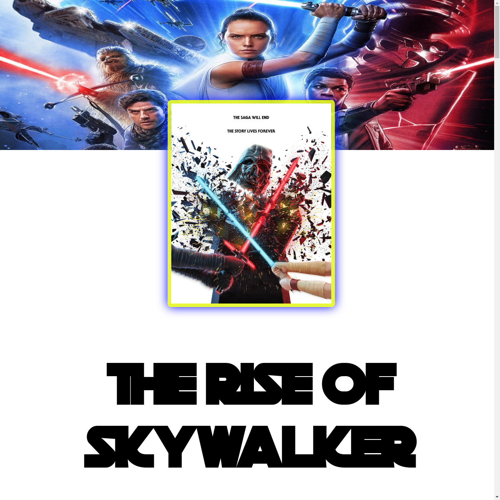
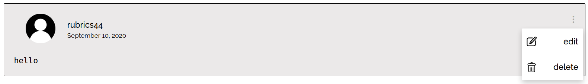

# Concordia Admissions Challenge

> JavaScript, HTML, and CSS Responsive Website Written for Concordia University

<div align='center'>
  
</div><br>

## Demo

[View the Live Demo](https://andrewbaldwin44.github.io/Concordia_Admission_Challenge/)

## The Challenge

Concordia's University's admission challenge is to build a website presenting a movie. The website must make use of HTML, CSS and JavaScript to create a functional and responsive website. The page must additionally include images and headers, and look visually similar to the provided mockup.

## Features

1. Fully responsive web design. Enjoy the site on any device!
2. Fully functional comment section. Users can create, edit, and delete comments.

<div align='center'>
  
</div><br>


## Deploy the project

__Clone the repo to your local machine using the terminal__:
```
$ git clone git@github.com:andrewbaldwin44/Concordia_Admission_Challenge.git
```

*Then Open the `index.html` Project File in Your Browser*

### Technologies Used:

- JavaScript
- HTML
- CSS

## Author

👤 **Andrew Baldwin**

- Github: [@andrewbaldwin44](https://github.com/andrewbaldwin44)
